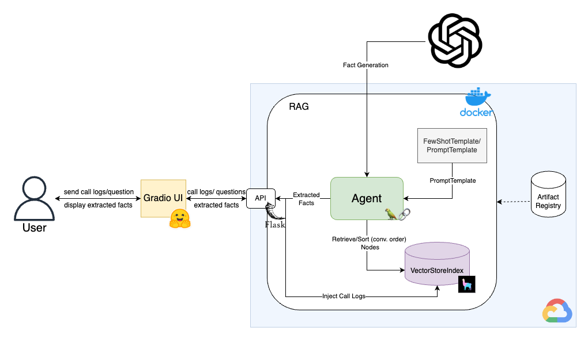
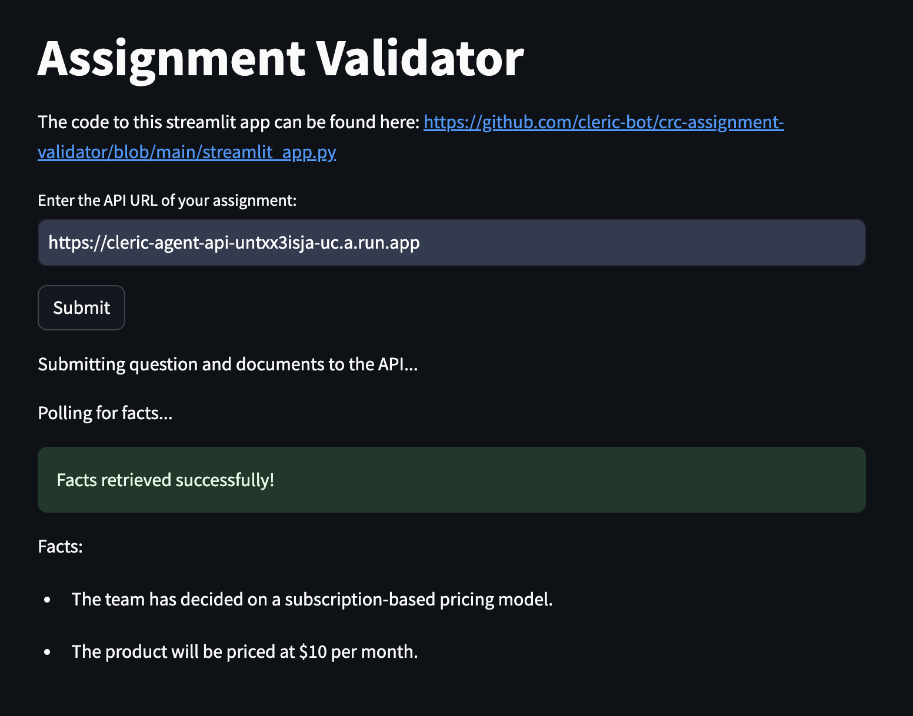

# Cleric Call Logs Retrival Augmented Generation Agent

This is a call logs RAG agent implemented with [LangChain](https://www.langchain.com/) and [LLamaIndex](https://www.llamaindex.ai/).
The application uses _FewShotPromptTemplate_ and _PromptTemplate_ to prompt LLM and create a list of facts extracted from the given documents.
LLamaIndex plays the role to store data chunks to a _VectorStore_ for the Agent to retrieve relevant information according to the question.
You can test it [here](https://huggingface.co/spaces/MitchelHsu/cleric-agent-ui).

- [Application URL](https://huggingface.co/spaces/MitchelHsu/cleric-agent-ui)
- [API Endpoint](https://cleric-agent-api-untxx3isja-uc.a.run.app)


## Implemented Architecture

The figure below shows the architecture of my implementation.
The core component is packaged as a container and hosted within GCP (Google Cloud Platform), the API endpoint is [here](https://cleric-agent-api-untxx3isja-uc.a.run.app). The UI is hosted with [HuggingFace Spaces](https://huggingface.co/spaces).




## Run with Docker

Pull the image from [this](https://hub.docker.com/repository/docker/mitchhsu/cleric-agent/general) container repo, the 
latest version is `v0.3`, you can use `latest` as well:
```shell
docker pull mitchhsu/cleric-agent:<version> 
```

Run container, the port of the application is set at `8000`:
```shell
docker run -p <host_port>:8000 mitchhsu/cleric-agent:<version>
```

To run the UI, just run:
```shell
python app/ui.py
```
Remember to install the dependencies by running `pip install -r requirements.txt`.


## Implementation Details

- `app/app.py`: Implements the API using Python Flask, there are two endpoints provided:
  - `submit_question_and_documents`: Handles user submissions of documents and question. Respond `"sucess"` if submission was successful. Error handling are covered when request schema mismatch, URLs format error, document load error, and no logs found.
  - `get_question_and_facts`: Handles user query of question and facts. Respond respective status of the query (`"done"`, `"processing"`, `"No data found"`).

    The endpoint also creates a `VectorStoreIndex` to split data into chunks, then passes a retriever for the Agent to retrieve relevant information.
- `app/agent.py`: Implements the agent logic, including prompt engineering. The agent is responsible for constructing a response given the call logs. Here I use `FewShotPromptTemplate` and `PromptTemplate` to format the prompt pass to `gpt`.
- `app/ui.py`: Implements the user interface using [gradio](https://www.gradio.app/).
- `app/utils.py`: Implements helper functions, such as URL validation, document retrieving, etc.
- `app/configs.py`: Stores configurations such as prompt templates and model selection.
- `app/models.py`: Defines the `pydantic` models for API request and response.


## Design Thinking Process

I initially developed a basic agent using a _PromptTemplate_, but I noticed random responses and lengthy statements, so I refined the prompt template and implemented a _FewShotTemplate_ (3-shot) for the better structure (see [here](https://github.com/MitchelHsu/Cleric-RAG-Agent/blob/main/app/config.py#L7)).
In anticipating challenge where the call logs might be extensive, therefore affecting the agent's accuracy and increase computational demands.
I leveraged LLamaIndex and _VectorStoreIndex_ to manage data chunks and facilitate the retrieval of essential information for the agent's extraction process.
And to preserve the order of the call logs, I sorted the retrieve data _nodes_ with their original order to ensure chronological decision-making.

Here is the example from the [validator](https://crc-assignment-validator-n65rz53nomn.streamlit.app/):

<p align="center">
  
</p>
